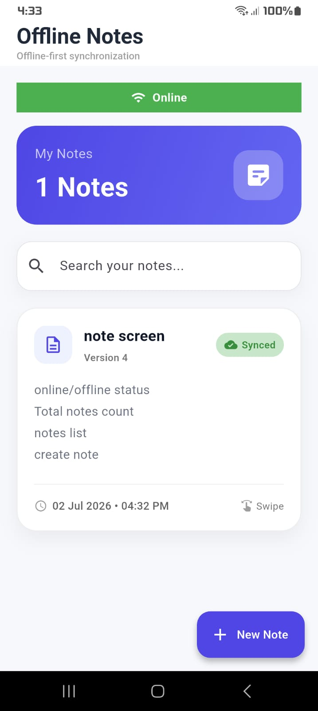
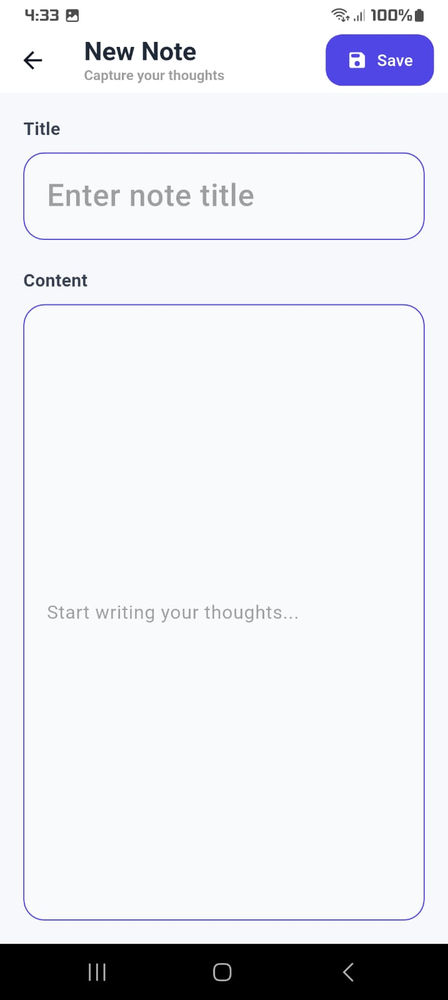
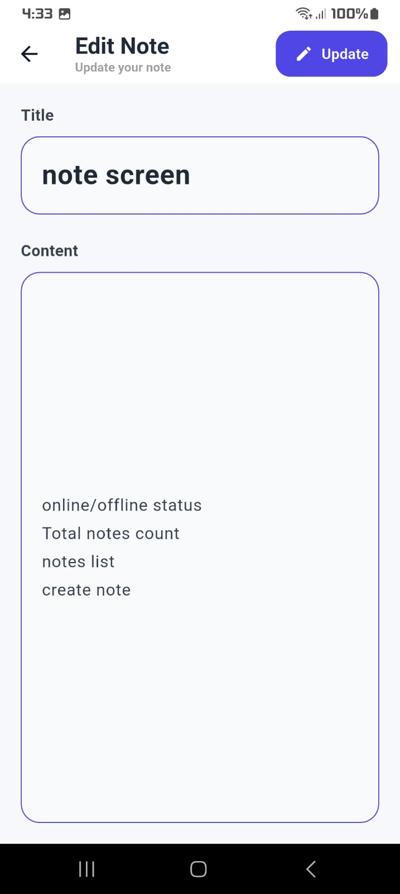
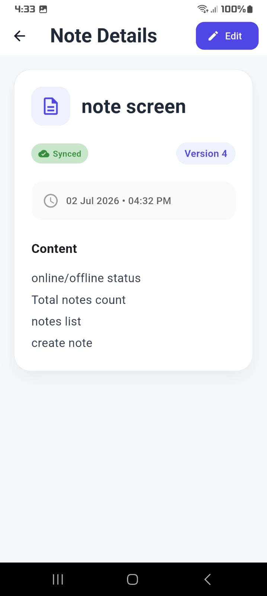
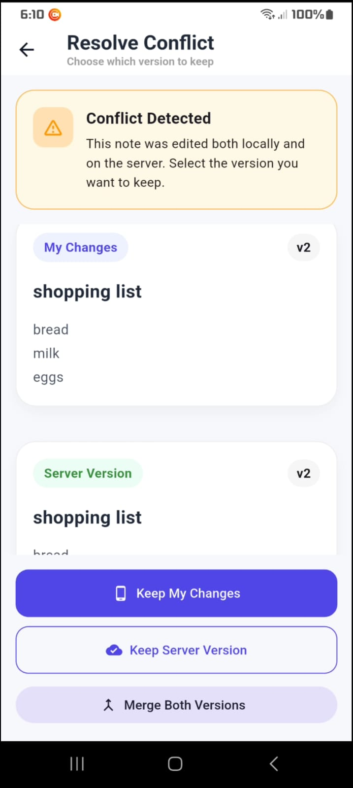
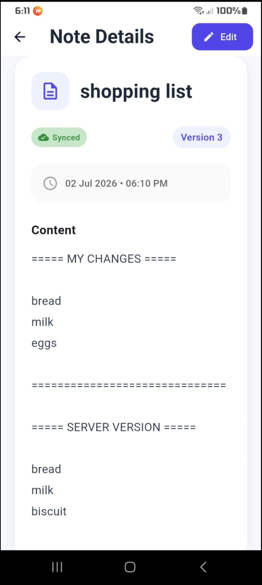

# 📒 Offline Notes

An offline-first Notes application built with **Flutter** following **Clean Architecture**, **Riverpod State Management**, **Repository Pattern**, **Hive Local Storage**, and **Dio** for networking.

The application allows users to create, edit, delete, and synchronize notes seamlessly between local storage and a remote server while handling synchronization conflicts using version-based conflict detection.

---

# ✨ Features

## 📝 Notes Management

- Create Notes
- Edit Notes
- Delete Notes
- View Note Details
- Search Notes
- Pull to Refresh

---

## 📶 Offline First

- Works completely offline
- Stores data locally using Hive
- Queue-based synchronization
- Automatic sync when internet is restored
- Manual pull-to-refresh synchronization

---

## 🔄 Synchronization

- Local-first architecture
- Sync Queue
- Automatic Background Sync
- Manual Sync
- Create Sync
- Update Sync
- Delete Sync

---

## ⚠ Conflict Detection & Resolution

Version-based conflict detection ensures that data is never overwritten unintentionally.

Supported conflict resolution options:

- ✅ Keep My Changes
- ✅ Keep Server Version
- ✅ Merge Both Versions

Conflicted notes are clearly highlighted in the UI for user action.

---

# 🏗 Architecture

The project follows **Clean Architecture**.

```
Presentation
│
├── Pages
├── Widgets
├── Providers (Riverpod)
│
Domain
│
├── Entities
├── Repositories
│
Data
│
├── Local Data Source (Hive)
├── Remote Data Source (Dio)
├── Repository Implementations
│
Core
│
├── Sync Manager
├── Connectivity
├── Network
└── Utilities
```

---

# 🛠 Tech Stack

| Technology | Usage |
|------------|-------|
| Flutter | Cross-platform Development |
| Riverpod | State Management |
| Hive | Local Database |
| Dio | REST API |
| MockAPI | Remote Backend |
| Connectivity Plus | Internet Detection |
| UUID | Local ID Generation |
| Clean Architecture | Project Structure |

---

# 🔄 Synchronization Flow

```
User Action
      │
      ▼
Save to Hive
      │
      ▼
Add Operation to Sync Queue
      │
      ▼
Offline
      │
Wait for Internet
      │
      ▼
Automatic Sync
      │
      ▼
Remote Server
```

---

# ⚠ Conflict Detection Flow

```
Last Synced Version
        │
        ▼
Local Version Updated
        │
        ▼
Server Version Updated
        │
        ▼
Conflict Detected
        │
        ▼
Resolve Conflict
        │
 ┌──────┼─────────┐
 ▼      ▼         ▼
Keep   Server   Merge
Local  Version  Both
```

---

# 📱 Screenshots

<table>
<tr>
<td align="center">
<b>Home Screen</b><br><br>

</td>

<td align="center">
<b>Add Note</b><br><br>

</td>
</tr>

<tr>
<td align="center">
<b>Edit Note</b><br><br>

</td>

<td align="center">
<b>Note Details</b><br><br>

</td>
</tr>

<tr>
<td align="center">
<b>Conflict Resolution</b><br><br>

</td>

<td align="center">
<b>Conflict Result</b><br><br>

</td>
</tr>
</table>

# 🎥 Demo Video

A complete walkthrough demonstrating:

- Create Notes
- Edit Notes
- Delete Notes
- Offline Storage
- Automatic Sync
- Manual Sync
- Conflict Detection
- Conflict Resolution
- Merge Both Versions

---

# 📂 Project Structure

```
lib
│
├── core
│   ├── network
│   ├── sync
│   ├── theme
│   └── utilities
│
├── features
│   └── notes
│       ├── data
│       │   ├── datasources
│       │   ├── models
│       │   └── repositories
│       │
│       ├── domain
│       │   ├── entities
│       │   └── repositories
│       │
│       └── presentation
│           ├── pages
│           ├── providers
│           └── widgets
│
└── main.dart
```

---

# 🚀 Getting Started

## Clone Repository

```bash
git clone <https://github.com/purnimahanchinal5120/offline-first-notes.git>
```

---

## Install Dependencies

```bash
flutter pub get
```

---

## Run Application

```bash
flutter run
```

---

## Build Release APK

```bash
flutter build apk --release
```

---

# 📦 Dependencies

- flutter_riverpod
- hive
- hive_flutter
- dio
- connectivity_plus
- uuid
- equatable
- intl

---

# 👩‍💻 Developed By

**Purnima Hanchinal**

Flutter Developer | Android and IOS

---